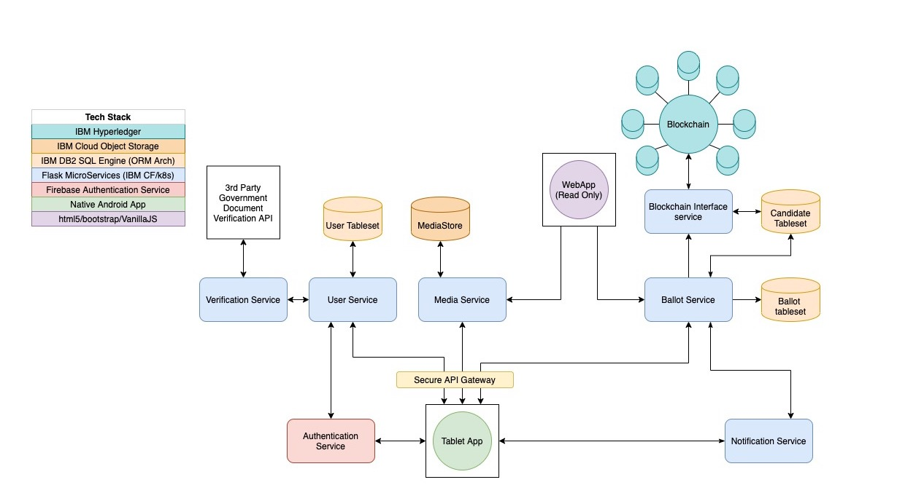

# Democratized E-Voting Platform


###### The Entire system comprizes of 3 entities:


  - Backend: This contains all the microservices and ethereum blockchain setup
  - Client App: This is a POC android app that interacts with the backend
  - MysqlDatabase: This is where all App Metadata is stored


##### Architecture


##### Schema


## Installation

##### Set up the blockchain service:

Navigate to `backend/blockchain/`
```sh
$ npm install ganache-cli web3@1.2.6
$ node_modules/.bin/ganache-cli
$ pip install -r requirements.txt
$ python3 main.py
```
##### Set up the other services:
Navigate to `/backend/<each service>`
```sh
$ pip install -r requirements.txt
$ python3 main.py
```

##### Set up MySql:
1. Install mysql 8.0.
2. (optional) Install MySQL workbench for ease.
3. run `/db/schema.sql`

##### Set up android app:
1. run `ifconfig` or `ipconfig` to get your local ip
2. Install android studio
3. Install android SDK
4. Run android studio and build project
